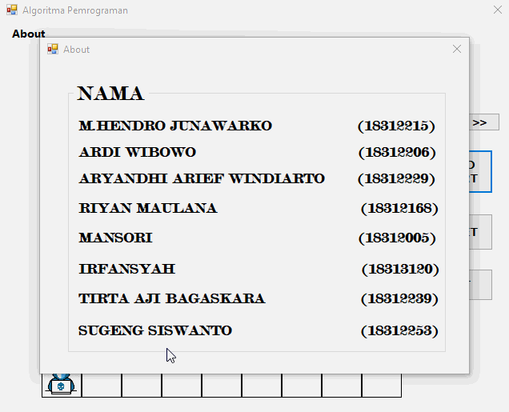

# Desktop_Depth-First_Search_Algorithm

Kode Mata Kuliah: INF 121 
Mata Kuliah: Algoritma Pemograman 
Jumlah SKS: 2 SKS (2 -0) 
Fakultas / Prodi: FTIK/Informatika 
Dosen: Agus Mulyanto, S.Kom., M.T 
Email : agus.mulyanto@teknokrat.ac.id

Tugas Akhir Algoritma Pemrograman dengan menggunakan algoritma pencarian graph DFS (Depth First Search)
 
 

 
 referensi :  https://rextester.com/YUYX6886, https://github.com/sakatimuna7/Projek-BFS
 
 
 
